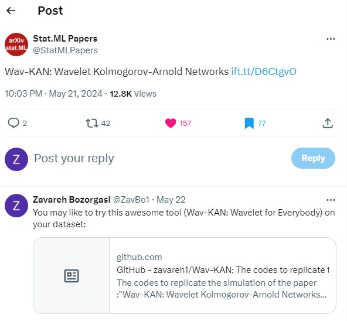

# Wav-KAN: Wavelet Kolmogorov-Arnold Networks
The codes to replicate the simulations of the paper:"Wav-KAN: Wavelet Kolmogorov-Arnold Networks". To see a diverse range of possible applications of Wav-KAN, check "Applications" folder!

### Links to the Paper
- Available at: [arXiv](https://arxiv.org/abs/2405.12832)
- Also available at: [SSRN](https://papers.ssrn.com/sol3/papers.cfm?abstract_id=4835325)
<!-- Citations at: [Google Scholar](https://scholar.google.com/scholar?hl=en&as_sdt=0%2C13&q=Wav-kan%3A+Wavelet+kolmogorov-arnold+networks&btnG=) -->
<!--https://www.semanticscholar.org/ -->
### We applied Wav-KAN to Hyperspectral Image Classification
- Available at: [arXiv](https://arxiv.org/abs/2406.07869)
<!-- - Citations at: [Google Scholar](https://scholar.google.com/scholar?hl=en&as_sdt=0%2C13&q=arxiv+%2B+Unveiling+the+Power+of+Wavelets%3A+A+Wavelet-based+Kolmogorov-Arnold+Network+for+Hyperspectral+Image+Classification&btnG=) -->
### Highlights of Wav-KAN on Social Media (**X**, formerly Twitter)
 

This image showcases Wav-KAN being highlighted and shared with the community on social media. It reflects the growing interest and engagement around this innovative framework.

## Current Contents of the Repository
- **MNIST Training and Testing**:
  - The repository currently contains the codes required to replicate MNIST training and testing.
  - More codes and examples will be added in future updates.
- **Possible applications of Wavelet/Wav-KAN**

## Abstract
In this paper, we introduce **Wav-KAN**, an innovative neural network architecture that leverages the **Wavelet Kolmogorov-Arnold Networks (Wav-KAN)** framework to enhance interpretability and performance.

Traditional multilayer perceptrons (MLPs) and even recent advancements like Spl-KAN face challenges such as:
- Interpretability
- Training speed
- Robustness
- Computational efficiency
- Performance limitations

### Wav-KAN addresses these issues by:
- Incorporating **wavelet functions** into the Kolmogorov-Arnold network structure.
- Efficiently capturing both **high-frequency** and **low-frequency components** of input data.
- Using **continuos (dyadic) wavelet transforms** for multiresolution analysis, eliminating the need for recalculations in detail extraction.

### Key Features:
- Wavelet-based approximations employ **orthogonal or semi-orthogonal bases**, balancing data structure representation and noise reduction.
- Enhanced accuracy, faster training speeds, and increased robustness compared to Spl-KAN and MLPs.
- Adaptability to the data structure, akin to how water conforms to its container.

Our results highlight the potential of Wav-KAN as a **powerful tool** for developing interpretable and high-performance neural networks, with applications across various fields. This work paves the way for further exploration and implementation of Wav-KAN in frameworks such as **PyTorch** and **TensorFlow**, aspiring to make wavelets in KAN as common as activation functions like **ReLU** and **sigmoid** in universal approximation theory (UAT).

## Future Updates
- Additional code implementations and simulations for Wav-KAN.


---

Stay tuned for updates! Feedback and contributions are welcome. 🚀


## Reference

If you find this repository helpful in your research or projects, please consider citing the following paper:

```bibtex
@article{bozorgasl2024wavkan,
  author  = {Zavareh Bozorgasl and Hao Chen},
  title   = {Wav-KAN: Wavelet Kolmogorov-Arnold Networks},
  journal = {arXiv preprint arXiv:2405.12832},
  year    = {2024},
  url     = {https://arxiv.org/abs/2405.12832}
}
